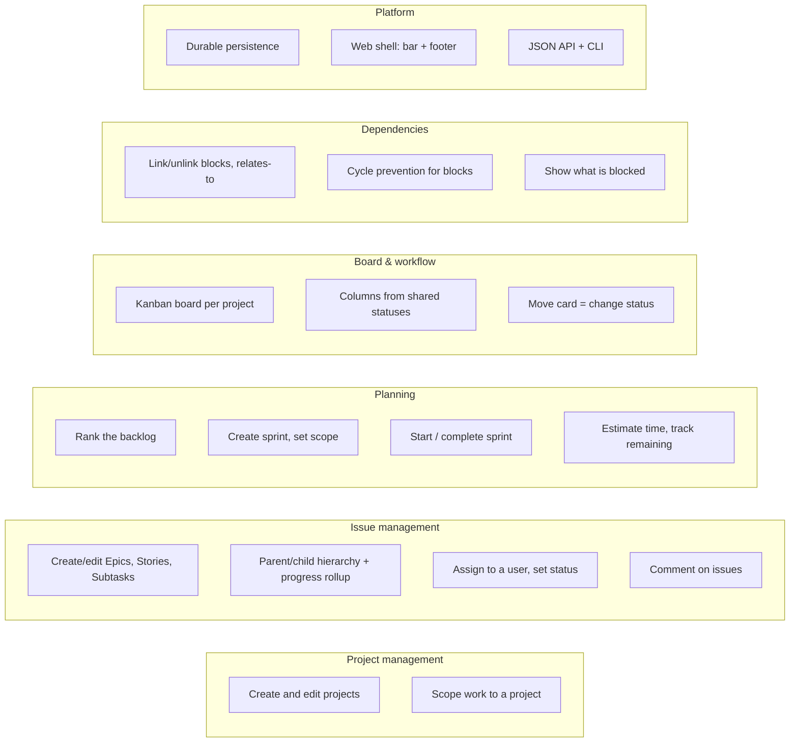

# Capabilities

What the Keel system must be able to do in v1, grouped by domain area. Capabilities describe *what*, not *how*; the entities they act on are defined in the [domain model](domain-model.md).

## Project management

* Create, rename, and describe projects.
* Keep every issue, board, sprint, and backlog scoped to exactly one project.
* Move between multiple coexisting projects.

## Issue management

* Create and edit issues of type Epic, Story, and Subtask (one unified issue — see [ADR 003](../adr/ADR-003.md)).
* Maintain the Epic → Story → Subtask parent/child hierarchy.
* Roll up child progress and effort to parent issues.
* Assign an issue to a user and set its reporter.
* Set and change an issue's status within the shared workflow (see [ADR 004](../adr/ADR-004.md)).
* Add and read comments on an issue.

## Planning

* Maintain a per-project backlog as one ranked list and reorder it (see [ADR 005](../adr/ADR-005.md)).
* Create sprints, add issues to a sprint, and remove them.
* Move a sprint through *planned → active → completed*; on completion, return unfinished issues to the backlog.
* Record a time-based estimate on an issue and update its remaining time as work progresses.
* View estimated and remaining time aggregated from child issues.

## Board & workflow

* Present a project's issues on a Kanban board.
* Derive board columns from the shared workflow statuses.
* Change an issue's status by moving its card between columns.

## Dependencies

* Create and remove directed, typed links between issues — *blocks* and *relates-to* (see [ADR 006](../adr/ADR-006.md)).
* Refuse a *blocks* link that would introduce a cycle.
* Show, for a given issue, what it blocks / is blocked by and what it relates to.

## Platform

* Durably persist all entities so work survives restarts (realization left open — see [domain model](domain-model.md)).
* Present the web UI within the existing shared chrome: sticky top menu bar ([ADR 001](../adr/ADR-001.md)) and version footer ([ADR 002](../adr/ADR-002.md)), using the recorded [brand colors](../brand-colors.md).
* Continue to expose the JSON API and the `keel` CLI as the existing platform does.

## Related documents

* [Context](context.md)
* [Use cases](use-cases.md)
* [Domain model](domain-model.md)
* [v1 scope](v1-scope.md)
