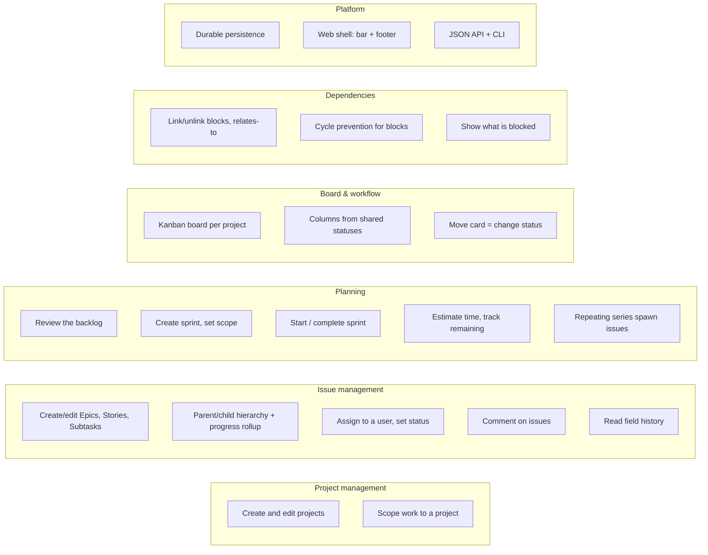

# Capabilities

What the Keel system must be able to do in v1, grouped by domain area. Capabilities describe *what*, not *how*; the entities they act on are defined in the [domain model](domain-model.md).

## Project management

* Create, rename, and describe projects.
* Keep every issue, board, sprint, and backlog scoped to exactly one project.
* Move between multiple coexisting projects.

## Issue management

* Create and edit issues of type Epic, Story, and Subtask (one unified issue — see [ADR 003](../adr/ADR-003.md)).
* Maintain the Epic → Story → Subtask parent/child hierarchy.
* Roll up child progress and effort to parent issues.
* Assign an issue to a user and set its reporter.
* Set and change an issue's status within the shared workflow (see [ADR 004](../adr/ADR-004.md)).
* Add and read comments on an issue. Issue descriptions and comment bodies render as Markdown on the issue page ([ADR 017](../adr/ADR-017.md)).
* Read a short per-issue changelog of status, assignee, sprint, estimate, remaining, due date, parent, type, title, and description ([ADR 023](../adr/ADR-023.md)).

## Planning

* Present a per-project backlog of unscheduled, unfinished issues in creation order (see [ADR 013](../adr/ADR-013.md), which amends [ADR 005](../adr/ADR-005.md)).
* Create sprints, add issues to a sprint, and remove them.
* Move a sprint through *planned → active → completed*, with at most one sprint active per project; on completion, carry unfinished issues into the next planned sprint or back to the backlog.
* Optionally run a project's sprints on a cadence so windows open and close without a manual Start or Complete click ([ADR 019](../adr/ADR-019.md)).
* Record a time-based estimate on an issue and update its remaining time as work progresses.
* View estimated and remaining time aggregated from child issues.
* Define a repeating series that spawns ordinary issues on a cadence ([ADR 021](../adr/ADR-021.md)).

## Board & workflow

* Present a project's issues on a Kanban board.
* Derive board columns from the shared workflow statuses.
* Restrict the board to chosen issue types, to a chosen assignee, and to a chosen sprint.
* Separate the board into a row of columns per sprint.
* Change an issue's status by moving its card between columns.

## Dependencies

* Create and remove directed, typed links between issues — *blocks* and *relates-to* (see [ADR 006](../adr/ADR-006.md)), including between issues in different projects (see [ADR 014](../adr/ADR-014.md)).
* Refuse a *blocks* link that would introduce a cycle anywhere in the blocking graph.
* Show, for a given issue, what it blocks / is blocked by and what it relates to, and mark unresolved blockers on board cards and backlog rows.

## Platform

* Durably persist all entities so work survives restarts (realized per [ADR 007](../adr/ADR-007.md); schema in the [data model](../design/data-model.md)).
* Present the web UI within the existing shared chrome: sticky top menu bar ([ADR 001](../adr/ADR-001.md)) and version footer ([ADR 002](../adr/ADR-002.md)), using the recorded [brand colors](../brand-colors.md). `/` is the acting user's inbox across projects ([ADR 022](../adr/ADR-022.md)). A phone-narrow viewport uses the same pages with a wrapping bar, swipeable board and tables, and the footer at the end of the page ([ADR 018](../adr/ADR-018.md)).
* Find an issue, project, sprint, or user from the top bar by key or name ([ADR 016](../adr/ADR-016.md)).
* Continue to expose the JSON API and the `keel` CLI as the existing platform does.

## Related documents

* [Context](context.md)
* [Use cases](use-cases.md)
* [Domain model](domain-model.md)
* [v1 scope](v1-scope.md)
* [Implementation plan](../design/implementation-plan.md)
* [API reference](../design/api.md)
* [UI design](../design/ui.md)
* [ADR 018: Phone layout of the existing site](../adr/ADR-018.md)
* [ADR 023: Lightweight per-issue field history](../adr/ADR-023.md)
