# System context

Keel is a personal, small-scale issue tracker — a lightweight, Jira-flavored tool for **one owner plus up to two collaborators**. It is self-hosted and run locally: the owner starts the app with `keel serve` and works through a browser. The same FastAPI application also exposes a JSON API and a small CLI.

Scope is deliberately proportional to a personal tool. Keel has **no organization or department hierarchy, no permission matrices, no SSO, and no third-party integrations** in v1.

## Actors

| Actor | Description |
| --- | --- |
| **Owner** | The primary user. Creates projects, plans work, runs sprints, works the board. Full run of the tool. |
| **Collaborator** | One or two trusted people who share the same projects. Same abilities as the owner in v1 (no roles or per-user restrictions). |

In v1 all users are trusted equals in a shared local/small-group context. There is **no authentication** — see [v1 scope](v1-scope.md) and the deferral noted below.

## External systems

Intentionally minimal. Keel talks only to:

* The **local web browser** the owner and collaborators use.
* The **local machine's durable storage**, where all projects, issues, sprints, boards, comments, and dependencies live. How that storage is realized was left open here and is decided in [ADR 007](../adr/ADR-007.md).

There are no external identity providers, email/notification services, webhooks, or cloud services in v1.

## System boundary

```mermaid
flowchart TD
  owner[Owner - primary user]
  collab[Collaborator - 1 to 2 people]
  browser[Web browser]
  cli[keel CLI]

  subgraph keelsys[Keel system]
    app[Keel app - FastAPI + server-rendered HTML + JSON API]
    store[(Durable storage - realization left open)]
  end

  owner --> browser
  collab --> browser
  owner --> cli
  browser --> app
  cli --> app
  app --> store
```

Everything inside `Keel system` ships and runs as one local application. The durable storage boundary is drawn deliberately loose: the architecture states only that entities must persist, not how.

## Existing platform constraints

Keel is an existing repository, and these committed constraints are respected rather than revisited here:

* Python-based FastAPI application served via Uvicorn, with a `keel` CLI and a `keel serve` command.
* Server-rendered HTML pages share a sticky top menu bar ([ADR 001](../adr/ADR-001.md)) and a sticky version footer ([ADR 002](../adr/ADR-002.md)), using the recorded [brand colors](../brand-colors.md).
* The product version has a single source of truth in `pyproject.toml`; see [Package version](../version.md). No version literal appears in these documents.

## Related documents

* [Use cases](use-cases.md)
* [Domain model](domain-model.md)
* [Capabilities](capabilities.md)
* [v1 scope](v1-scope.md)
* [Glossary](glossary.md)
* [Module layout](../design/module-layout.md)
