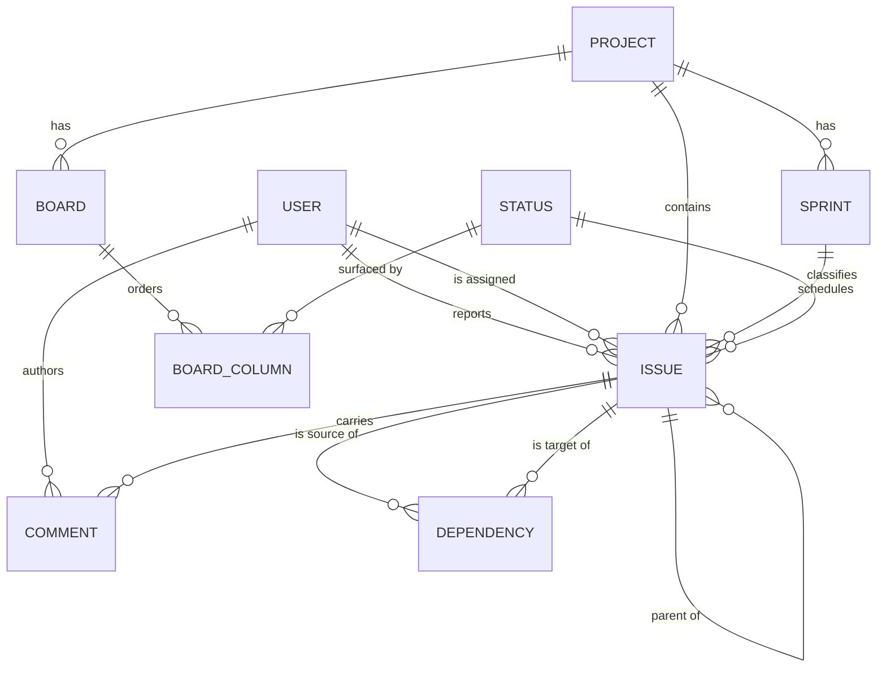

# Domain model

A conceptual entity–relationship model for Keel v1. It names the domain entities, their meaningful attributes in domain terms, and how they relate. It is deliberately **conceptual**: no tables, columns, data types, keys, or indexes. How these entities are stored is left open (see *Persistence* below).

Terms are defined in the [glossary](glossary.md). The modeling decisions behind this diagram are recorded in [ADR 003](../adr/ADR-003.md), [ADR 004](../adr/ADR-004.md), [ADR 005](../adr/ADR-005.md), and [ADR 006](../adr/ADR-006.md).

## Entity–relationship diagram

## Entities

Each entity lists its attributes in domain terms only.

### User
The owner or a collaborator. In v1 there are no roles and no authentication.
* Display name.
* Relationships: reports many issues; is assigned many issues; authors many comments.

### Project
A first-class container that scopes a body of work. Multiple projects coexist.
* Name; short description.
* Relationships: contains many issues; has many boards; has many sprints. Its **backlog** is not a separate entity — it is the ordered set of the project's issues not scheduled in an active sprint (see [ADR 005](../adr/ADR-005.md)).

### Issue
The single work entity. Its **type** distinguishes an Epic, a Story, or a Subtask; the parent relationship forms the Epic → Story → Subtask hierarchy. Modeled as one entity per [ADR 003](../adr/ADR-003.md).
* Title; description.
* Type — one of *Epic*, *Story*, *Subtask*.
* Status — one of the shared workflow statuses (see Status).
* Backlog rank — the item's order within its project's backlog.
* Estimated time; time remaining — time-based effort tracking for the issue.
* Relationships: belongs to one project; optionally has one parent issue and many child issues; optionally scheduled in one sprint; classified by one status; reported by one user; optionally assigned to one user; carries many comments; participates in many dependencies as source and as target.

### Status
A state in the shared, fixed workflow (for example *To Do*, *In Progress*, *Done*). The status set is shared across all projects and is not user-configurable in v1 — see [ADR 004](../adr/ADR-004.md).
* Name; ordinal position in the workflow.
* Relationships: classifies many issues; surfaced by many board columns.

### Board
A project's Kanban view. It presents the project's issues as cards arranged by status. A board is a **view** over the project's issue pool, not a container that owns issues (see [ADR 005](../adr/ADR-005.md)).
* Name.
* Relationships: belongs to one project; orders many board columns.

### Board column
A vertical lane on a board that surfaces the issues currently in one status.
* Order on the board.
* Relationships: belongs to one board; surfaces one status.

### Sprint
A time-boxed set of scheduled issues within a project. Sprint membership is an attribute of the issue, not a separate copy of it (see [ADR 005](../adr/ADR-005.md)).
* Name; goal.
* State — one of *planned*, *active*, *completed*.
* Start date; end date.
* Relationships: belongs to one project; schedules many issues.

### Dependency
A directed, typed link between two issues. A *blocks* link asserts an ordering constraint; a *relates-to* link is a non-blocking association. *Blocks* links must not form a cycle (see [ADR 006](../adr/ADR-006.md)).
* Kind — one of *blocks*, *relates-to*.
* Relationships: has one source issue and one target issue.

### Comment
A note attached to an issue, capturing discussion and context over time.
* Body; time written.
* Relationships: belongs to one issue; authored by one user.

## Backlog (a view, not an entity)

The backlog is the ordered list of a project's issues that are **not scheduled in an active sprint**, sorted by each issue's backlog rank. It is derived from Issue attributes rather than stored as its own entity. This keeps a single source of truth for every issue regardless of whether it is being viewed on the board, in a sprint, or in the backlog — see [ADR 005](../adr/ADR-005.md).

## Persistence

Every entity above must be **durably stored** so that projects, issues, sprints, boards, comments, and dependencies survive restarts. **How** persistence is realized — storage engine, schema, and access approach — is a low-level concern deliberately left open at the system level, to be resolved at the component/blueprint stage or in its own future ADR. This document specifies *that* entities persist, not *how*.

## Related documents

* [Context](context.md)
* [Use cases](use-cases.md)
* [Capabilities](capabilities.md)
* [v1 scope](v1-scope.md)
* [Glossary](glossary.md)
