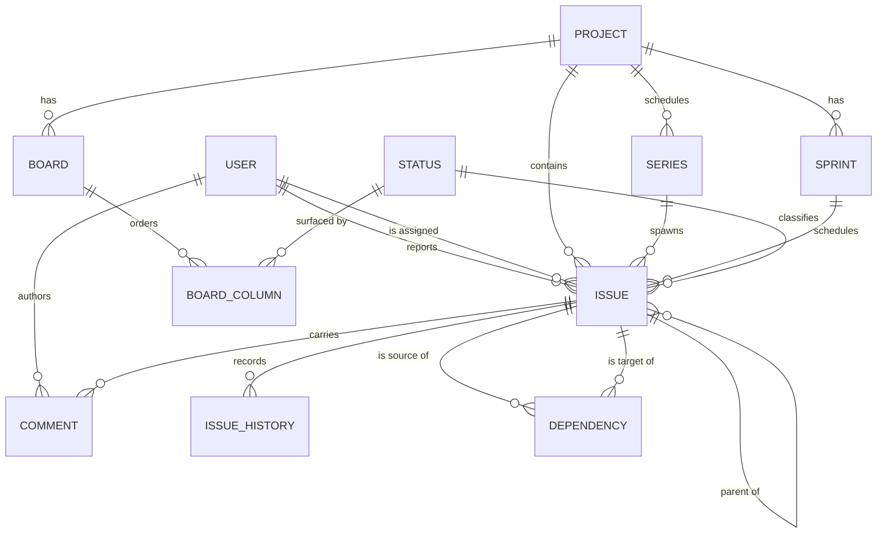

# Domain model

A conceptual entity–relationship model for Keel v1. It names the domain entities, their meaningful attributes in domain terms, and how they relate. It is deliberately **conceptual**: no tables, columns, data types, keys, or indexes. The physical realization is documented separately in the [data model](../design/data-model.md).

Terms are defined in the [glossary](glossary.md). The modeling decisions behind this diagram are recorded in [ADR 003](../adr/ADR-003.md), [ADR 004](../adr/ADR-004.md), [ADR 005](../adr/ADR-005.md), and [ADR 006](../adr/ADR-006.md). Their implementation-level realization is recorded in [ADR 012](../adr/ADR-012.md), [ADR 013](../adr/ADR-013.md), and [ADR 014](../adr/ADR-014.md).

## Entity–relationship diagram

## Entities

Each entity lists its attributes in domain terms only.

### User
The owner or a collaborator. In v1 there are no roles and no authentication.
* Display name.
* Relationships: reports many issues; is assigned many issues; authors many comments.

### Project
A first-class container that scopes a body of work. Multiple projects coexist.
* Name; short description.
* Key — a short identifier that prefixes the project's issue numbers (see [ADR 012](../adr/ADR-012.md)).
* Sprint cadence — off, or a rhythm that automatically opens and closes sprints (see [ADR 019](../adr/ADR-019.md)).
* Relationships: contains many issues; has many boards; has many sprints; has many repeating series. Its **backlog** is not a separate entity — it is a derived view over the project's issues (see Backlog below).

### Issue
The single work entity. Its **type** distinguishes an Epic, a Story, or a Subtask; the parent relationship forms the Epic → Story → Subtask hierarchy. Modeled as one entity per [ADR 003](../adr/ADR-003.md).
* Title; description.
* Type — one of *Epic*, *Story*, *Subtask*.
* Number — a per-project sequence which, with the project's key, names the issue (see [ADR 012](../adr/ADR-012.md)).
* Status — one of the shared workflow statuses (see Status).
* Estimated time; time remaining — time-based effort tracking for the issue.
* Relationships: belongs to one project; optionally has one parent issue and many child issues; optionally scheduled in one sprint; optionally belongs to one repeating series as an occurrence; classified by one status; reported by one user; optionally assigned to one user; carries many comments; records many history lines; participates in many dependencies as source and as target.

### Status
A state in the shared, fixed workflow. The status set is shared across all projects and is not user-configurable in v1 — see [ADR 004](../adr/ADR-004.md). The concrete set is *To Do*, *In Progress*, *In Review*, *Blocked*, *Done*, and *Cancelled*. *Done* and *Cancelled* are closed; only *Done* is completed ([ADR 020](../adr/ADR-020.md)). Because the set is fixed, it is realized as an enumeration in code rather than as stored records (see [ADR 013](../adr/ADR-013.md)).
* Name; ordinal position in the workflow.
* Relationships: classifies many issues; surfaced by many board columns.

### Board
A project's Kanban view. It presents the project's issues as cards arranged by status. A board is a **view** over the project's issue pool, not a container that owns issues (see [ADR 005](../adr/ADR-005.md)).
* Name.
* Relationships: belongs to one project; orders many board columns.

### Board column
A vertical lane on a board that surfaces the issues currently in one status.
* Order on the board.
* Relationships: belongs to one board; surfaces one status.

### Sprint
A time-boxed set of scheduled issues within a project. Sprint membership is an attribute of the issue, not a separate copy of it (see [ADR 005](../adr/ADR-005.md)).
* Name; goal.
* State — one of *planned*, *active*, *completed*.
* Start date; end date.
* Relationships: belongs to one project; schedules many issues.

### Series
A repeating recipe that spawns ordinary issues. Recurrence is not an issue type ([ADR 021](../adr/ADR-021.md)).
* Title; default description; type; assignee; optional parent.
* Cadence (daily / weekly / monthly / yearly, with interval and optional end).
* Spawn mode — on the calendar, or after the previous copy is closed.
* Sprint assignment basis — creation date or due date; look-ahead N when no sprint overlaps.
* State — *active*, *paused*, or *stopped*.
* Relationships: belongs to one project; spawns many issue occurrences.

### Dependency
A directed, typed link between two issues. A *blocks* link asserts an ordering constraint; a *relates-to* link is a non-blocking association. *Blocks* links must not form a cycle (see [ADR 006](../adr/ADR-006.md)).
* Kind — one of *blocks*, *relates-to*.
* Relationships: has one source issue and one target issue.

### Comment
A note attached to an issue, capturing discussion and context over time.
* Body; time written.
* Relationships: belongs to one issue; authored by one user.

### Issue history
A reconstructive changelog of field changes on one issue ([ADR 023](../adr/ADR-023.md)). Not a product-wide audit log.
* Who; when; field; previous value; new value.
* Relationships: belongs to one issue.

## Backlog (a view, not an entity)

The backlog is the list of a project's issues that have **no sprint assigned** and are **not closed**, ordered by when they were created, oldest first. It is derived from Issue attributes rather than stored as its own entity. This keeps a single source of truth for every issue regardless of whether it is being viewed on the board, in a sprint, or in the backlog — see [ADR 005](../adr/ADR-005.md).

[ADR 013](../adr/ADR-013.md) amends [ADR 005](../adr/ADR-005.md) here: the backlog carries no manual rank, and membership is defined by having no sprint at all rather than by not being in an *active* sprint, so pulling an issue into a planned sprint removes it from the backlog immediately.

## Persistence

Every entity above must be **durably stored** so that projects, issues, sprints, boards, comments, issue history, and dependencies survive restarts. **How** persistence is realized was deliberately left open at the system level and is now decided in [ADR 007](../adr/ADR-007.md), with the concrete schema in the [data model](../design/data-model.md). This document specifies *that* entities persist, not *how*.

## Related documents

* [Context](context.md)
* [Use cases](use-cases.md)
* [Capabilities](capabilities.md)
* [v1 scope](v1-scope.md)
* [Glossary](glossary.md)
* [Data model (physical schema)](../design/data-model.md)
