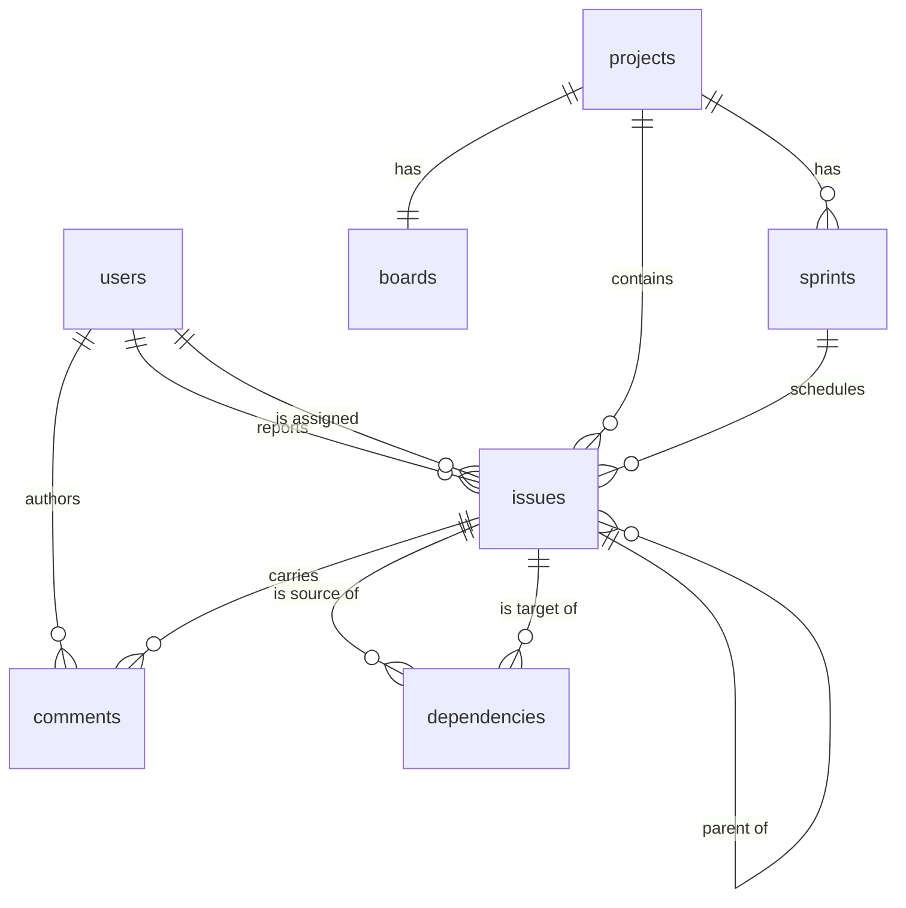

# Data model

The physical schema behind the conceptual [domain model](../architecture/domain-model.md). Storage decisions are recorded in [ADR 007](../adr/ADR-007.md); the rules the constraints enforce come from [ADR 012](../adr/ADR-012.md), [ADR 013](../adr/ADR-013.md), and [ADR 014](../adr/ADR-014.md).

All tables live in one SQLite file. Every connection sets `PRAGMA foreign_keys=ON`, without which SQLite silently ignores foreign keys.

## Entity relationships

## Conventions

* Primary keys are `INTEGER PRIMARY KEY`, SQLite's rowid alias.
* Timestamps are stored in UTC. `created_at` and `updated_at` are timestamps; sprint `starts_on` and `ends_on` are dates.
* Enumerated values are stored as lowercase strings guarded by `CHECK` constraints, not as foreign keys. Board columns are generated from the code enumeration and are not stored ([ADR 013](../adr/ADR-013.md)).
* Text columns that represent "no value entered" use `NOT NULL DEFAULT ''` rather than allowing null, so queries need no null handling.
* Deletion behaviour is enforced in services so users receive coded errors; the `ON DELETE` clauses below are a backstop, not the primary mechanism ([ADR 012](../adr/ADR-012.md)).

## Tables

### users

| Column | Type | Constraints |
| --- | --- | --- |
| `id` | INTEGER | primary key |
| `display_name` | TEXT | not null, unique |
| `created_at` | TIMESTAMP | not null |

A user is refused deletion while referenced as a reporter, assignee, or comment author (`user.in_use`). The referencing foreign keys use `ON DELETE RESTRICT`.

### projects

| Column | Type | Constraints |
| --- | --- | --- |
| `id` | INTEGER | primary key |
| `key` | TEXT | not null, unique, `CHECK` length between 2 and 10 |
| `name` | TEXT | not null |
| `description` | TEXT | not null, default `''` |
| `issue_seq` | INTEGER | not null, default 0 |
| `sprint_cadence` | TEXT | not null, default `'off'`, `CHECK` in (`off`, `weekly`, `two_weeks`, `monthly`, `every_n_days`) |
| `sprint_cadence_days` | INTEGER | nullable, `CHECK` null or `>= 1` |
| `auto_sprint_notice` | TEXT | not null, default `''` |
| `created_at` | TIMESTAMP | not null |

`key` is uppercase and starts with a letter; the full pattern is validated in the schema layer, with length checked in the database. `issue_seq` is the per-project issue counter from [ADR 012](../adr/ADR-012.md), incremented in the same transaction that inserts an issue and never decremented, so numbers are not reused. `sprint_cadence` is off until the project opts in; `sprint_cadence_days` is the N for *every N days* ([ADR 019](../adr/ADR-019.md)). `auto_sprint_notice` holds the last automatic open/close message for the sprints page.

### boards

| Column | Type | Constraints |
| --- | --- | --- |
| `id` | INTEGER | primary key |
| `project_id` | INTEGER | not null, unique, references `projects(id)` `ON DELETE CASCADE` |
| `name` | TEXT | not null |

One row per project, created with the project. The unique constraint enforces the one-board rule of [ADR 013](../adr/ADR-013.md) while leaving room for the multiple boards [ADR 005](../adr/ADR-005.md) permits later. Board columns are not stored.

### sprints

| Column | Type | Constraints |
| --- | --- | --- |
| `id` | INTEGER | primary key |
| `project_id` | INTEGER | not null, references `projects(id)` `ON DELETE CASCADE` |
| `name` | TEXT | not null |
| `goal` | TEXT | not null, default `''` |
| `state` | TEXT | not null, default `'planned'`, `CHECK` in (`planned`, `active`, `completed`) |
| `starts_on` | DATE | nullable |
| `ends_on` | DATE | nullable, `CHECK` null or not before `starts_on` |
| `created_at` | TIMESTAMP | not null |
| `completed_at` | TIMESTAMP | nullable |

Indexes and constraints:

* `ix_sprints_project_id` on (`project_id`)
* `uq_sprints_one_active` — a partial unique index on (`project_id`) `WHERE state = 'active'`, enforcing the single active sprint per project from [ADR 013](../adr/ADR-013.md)

### issues

| Column | Type | Constraints |
| --- | --- | --- |
| `id` | INTEGER | primary key |
| `project_id` | INTEGER | not null, references `projects(id)` `ON DELETE CASCADE` |
| `number` | INTEGER | not null |
| `type` | TEXT | not null, `CHECK` in (`epic`, `story`, `subtask`) |
| `title` | TEXT | not null |
| `description` | TEXT | not null, default `''` |
| `status` | TEXT | not null, default `'todo'`, `CHECK` in (`todo`, `in_progress`, `in_review`, `blocked`, `done`, `cancelled`) |
| `parent_id` | INTEGER | nullable, references `issues(id)` `ON DELETE RESTRICT` |
| `sprint_id` | INTEGER | nullable, references `sprints(id)` `ON DELETE SET NULL` |
| `reporter_id` | INTEGER | nullable, references `users(id)` `ON DELETE RESTRICT` |
| `assignee_id` | INTEGER | nullable, references `users(id)` `ON DELETE RESTRICT` |
| `estimate_minutes` | INTEGER | nullable, `CHECK` not negative |
| `remaining_minutes` | INTEGER | nullable, `CHECK` not negative |
| `due_at` | TIMESTAMP | nullable |
| `created_at` | TIMESTAMP | not null |
| `updated_at` | TIMESTAMP | not null |

Indexes and constraints:

* `uq_issues_project_number` — unique on (`project_id`, `number`), backing the `KEY-123` identifier
* `ix_issues_project_status` on (`project_id`, `status`) for board rendering
* `ix_issues_project_created` on (`project_id`, `created_at`) for backlog ordering
* `ix_issues_parent_id` on (`parent_id`) for hierarchy and rollup traversal
* `ix_issues_sprint_id` on (`sprint_id`) for sprint membership

Rules not expressible as constraints and therefore enforced in `keel.domain` and `keel.services`: the type-specific parent rules, same-project parenthood, ancestor cycle prevention, and the refusal to delete an issue with children. `ON DELETE RESTRICT` on `parent_id` is the backstop for the last of these.

### dependencies

| Column | Type | Constraints |
| --- | --- | --- |
| `id` | INTEGER | primary key |
| `source_id` | INTEGER | not null, references `issues(id)` `ON DELETE CASCADE` |
| `target_id` | INTEGER | not null, references `issues(id)` `ON DELETE CASCADE` |
| `kind` | TEXT | not null, `CHECK` in (`blocks`, `relates_to`) |
| `created_at` | TIMESTAMP | not null |

Indexes and constraints:

* `uq_dependencies_edge` — unique on (`source_id`, `target_id`, `kind`), rejecting duplicates
* `ck_dependencies_not_self` — `CHECK` (`source_id` is not `target_id`)
* `ix_dependencies_target_kind` on (`target_id`, `kind`) for blocker counts

There is no project column: links may cross projects ([ADR 014](../adr/ADR-014.md)), and cascade reaches a row through either endpoint. Cycle prevention is not expressible as a constraint and is enforced before insert.

### comments

| Column | Type | Constraints |
| --- | --- | --- |
| `id` | INTEGER | primary key |
| `issue_id` | INTEGER | not null, references `issues(id)` `ON DELETE CASCADE` |
| `author_id` | INTEGER | nullable, references `users(id)` `ON DELETE RESTRICT` |
| `body` | TEXT | not null |
| `created_at` | TIMESTAMP | not null |

Index: `ix_comments_issue_created` on (`issue_id`, `created_at`).

## Derived, not stored

Three things the [domain model](../architecture/domain-model.md) describes have no table, by design.

**Board columns.** Generated by iterating the status enumeration in ordinal order ([ADR 013](../adr/ADR-013.md)).

**The backlog.** A project's issues where `sprint_id IS NULL` and `status` is not `done` or `cancelled`, ordered by `created_at` ascending. This is the amended definition from [ADR 013](../adr/ADR-013.md), which supersedes the rank-based definition in [ADR 005](../adr/ADR-005.md).

**Effort and progress rollup.** Computed per request with a recursive query walking `parent_id` down from the issue, summing `estimate_minutes` over the subtree, summing `remaining_minutes` excluding cancelled descendants, counting descendants whose status is `done`, and counting descendants whose status is `cancelled` separately. Nothing is cached or denormalized.

## Deletion behaviour

| Action | Result |
| --- | --- |
| Delete issue with children | Refused, `issue.has_children` |
| Delete childless issue | Cascades its comments and every dependency naming it |
| Delete project | Cascades issues, sprints, board, and through issues their comments and dependency links, including links whose other end is in another project |
| Delete sprint | Its issues are unscheduled, not deleted |
| Delete user still referenced | Refused, `user.in_use` |

## Migrations

Alembic revisions live in `migrations/`. They were written by hand and reviewed against the models, because autogenerate does not reliably detect `CHECK` constraint changes, and SQLite column alterations use Alembic's batch operations. Migrations are applied only by `keel db upgrade`; `keel serve` verifies the revision and refuses to start when the database is behind ([ADR 007](../adr/ADR-007.md)).

| Revision | Adds |
| --- | --- |
| `0001` | `users` |
| `0002` | `projects`, `boards`, `issues` |
| `0003` | `issues.due_at` |
| `0004` | `sprints` and `issues.sprint_id` |
| `0005` | `dependencies` |
| `0006` | `comments` |
| `0007` | `projects.sprint_cadence` |
| `0008` | `cancelled` on `issues.status` |

## Related documents

* [ADR 007: Persistence via SQLite, SQLAlchemy, and Alembic](../adr/ADR-007.md)
* [ADR 012: Issue realization](../adr/ADR-012.md)
* [ADR 013: Planning realization](../adr/ADR-013.md)
* [ADR 014: Cross-project dependencies and cycle detection](../adr/ADR-014.md)
* [ADR 020: Cancelled status](../adr/ADR-020.md)
* [Domain model](../architecture/domain-model.md)
* [API reference](api.md)
* [Module layout](module-layout.md)
