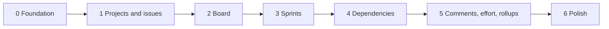

# Implementation plan

The order in which Keel v1 is built. Phases are vertical slices: each one ends with something usable through the browser, the JSON API, and the test suite, rather than a layer that cannot yet be exercised.

Every phase ends green on `poe check`, which runs pre-commit — including isort, mypy, and the full pytest run at 90% coverage.

Coverage is measured across every suite rather than the unit tests alone. The routers and form handlers are thin translations between HTTP and the services, and they cannot be reached without an application and a database, so holding them to a unit-only figure would either exempt them or force integration tests to masquerade as unit tests.

## Phase 0 — Foundation

**Status: done.**

Everything later phases stand on, plus the first entity end to end so the plumbing is proven rather than assumed.

* Add the SQLAlchemy, Alembic, Jinja2, and `platformdirs` dependencies to `pyproject.toml`, pinned exactly, with a `package-data` entry for templates.
* Extend `keel/settings.py` with `database_url` and `default_user`; extend `keel/paths.py` with `data_dir()` and `templates_dir()`.
* Build `keel/db/`: declarative base, engine with `PRAGMA foreign_keys=ON` and a busy timeout, request-scoped session dependency, head-revision check.
* Scaffold Alembic in `migrations/`, reading the same settings.
* Add the `db upgrade` and `db revision` CLI subcommands; make `keel serve` refuse to start when the schema is behind.
* Convert the chrome in `keel/web/layout.py` into `base.html` and retire the module, keeping the existing home and license pages passing.
* Add the domain error type and the API exception handlers.
* Add users: model, service, schemas, JSON routes, users page, current-user resolution, top-bar picker, and first-run seeding.

Done when a fresh database is created by `keel db upgrade`, `keel serve` starts, the home page renders through Jinja2 with the picker populated by a seeded user, and users can be managed from the browser and the API.

## Phase 1 — Projects and issues

**Status: done.**

* Project model, service, schemas, JSON routes, list and detail pages, with the key validated and the board row created alongside. The list sits at `/projects` beside `/users`, and `/` redirects to it ([UI design](ui.md)).
* Issue model with per-project numbering drawn from the project counter inside the insert transaction.
* Hierarchy rules in `keel/domain/hierarchy.py` — type-specific parents, same-project parenthood, ancestor cycle prevention — enforced in the issue service.
* The status enumeration, with issues created in the first status.
* Issue create, edit, and detail pages; issue JSON routes with their filters.
* Deletion rules for issues, projects, and users, each returning its coded error.

Done when projects and a full Epic, Story, and Subtask hierarchy can be created and edited from both the browser and the API, illegal parents are refused with the right codes, and issues are addressable as `KEEL-12`.

## Phase 2 — Board

**Status: done.**

* Board projection service grouping a project's issues by status, with the type filter applied in the query.
* Board page rendering columns from the status enumeration.
* Fallback status form on every card, posting to `/web/issues/{id}/status`.
* `assets/js/board.js` implementing native drag-and-drop against the issue `PATCH` endpoint, hiding the fallback controls once loaded.

Done when a card can be dragged between columns and the change survives a reload, the same move works with JavaScript disabled, and the type filter changes what the board queries.

## Phase 3 — Sprints

* Sprint model with the partial unique index enforcing one active sprint per project.
* Lifecycle service: start with its active-sprint check, complete with carry-over into the earliest remaining planned sprint or back to the backlog.
* Sprint list and detail pages, JSON routes, and the start and complete actions with their fallback forms.
* Backlog projection — no sprint assigned and not Done, oldest first — and the backlog page with a control to schedule an issue into a planned sprint.

Done when a sprint can be planned, filled from the backlog, started, and completed; a second start in the same project is refused; and completing one reports what was carried and where.

## Phase 4 — Dependencies

* Dependency model with its uniqueness and self-link constraints.
* Cycle detection in `keel/domain/graph.py` as a pure function, with the service performing the check and insert in one transaction.
* Dependency JSON routes and the grouped section on the issue detail page, naming the project of any cross-project link.
* Blocker counts as one aggregate query per view, rendered as markers on board cards and backlog rows.

Done when links can be created and removed across projects, a link that would close a cycle is refused with `dependency.cycle`, and cards show accurate blocker markers.

## Phase 5 — Comments, effort, and rollups

* Comment model, service, JSON routes, and the thread with its form on the issue detail page, authored by the acting user.
* Duration parsing and formatting in `keel/domain/duration.py` for the `2h`, `90m`, `1h 30m`, and `1d` forms.
* Estimate and remaining fields on the issue forms, stored as minutes.
* Rollup in `keel/domain/rollup.py` over a recursive subtree query, shown alongside an issue's own values, with progress as descendants done over descendants.

Done when comments can be added and read, effort round-trips through the shorthand without loss, and an Epic shows both its own effort and its subtree totals with a progress count.

## Phase 6 — Polish

* README: keep the settings table, the `keel db` commands, and the database location current as later phases add to them (Phase 0 wrote the first version).
* Cross-link the architecture and design documents where implementation revealed gaps.
* Close any coverage shortfall and review every generated Alembic revision one final time.

## Verification

| Layer | Approach |
| --- | --- |
| Domain rules | Unit tests calling pure functions directly, no fixtures |
| Services | Unit tests against an in-memory SQLite database per test |
| Routes | Integration tests through httpx against the application |
| End to end | System tests against a live server |
| Board JavaScript | Not executed by the suite; its endpoints and fallback routes are covered automatically and dragging is checked by hand ([ADR 009](../adr/ADR-009.md)) |

## Related documents

* [Module layout](module-layout.md)
* [Data model](data-model.md)
* [API reference](api.md)
* [UI design](ui.md)
* [Capabilities](../architecture/capabilities.md)
* [v1 scope](../architecture/v1-scope.md)
