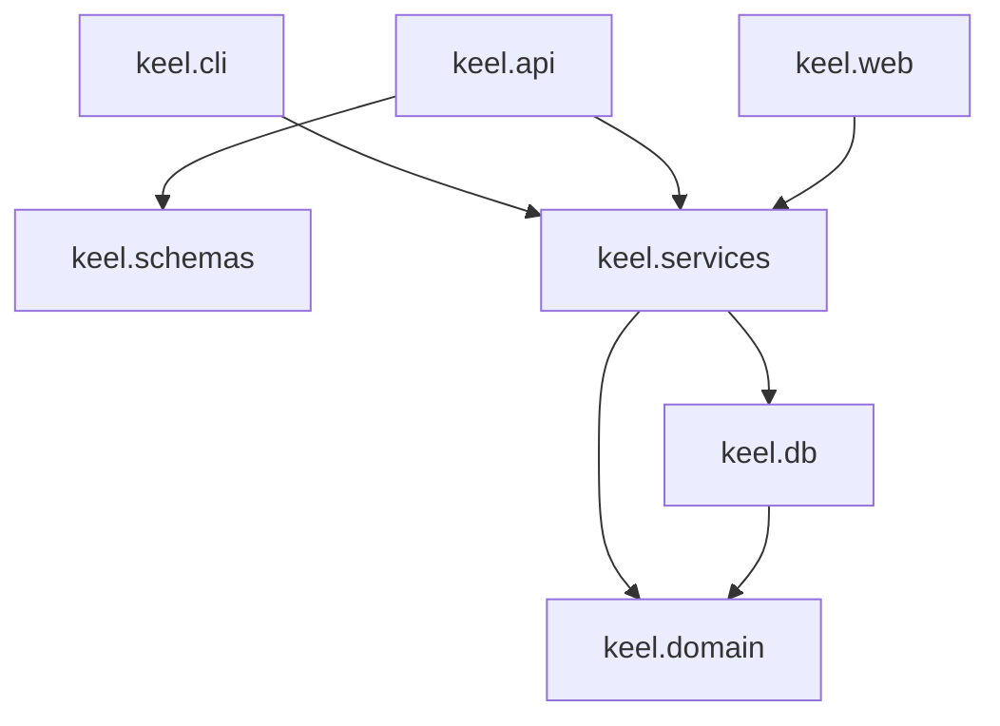

# Module layout

How `src/keel/` is organized and what each layer may depend on. The decision is recorded in [ADR 008](../adr/ADR-008.md).

## The rule

Dependencies point one way only: transport depends on services, services depend on the domain and on models, and nothing depends upward. `keel.domain` is pure — it imports only the standard library, never SQLAlchemy, FastAPI, or another `keel` layer — which is what makes its rules testable without fixtures.

## Tree

```text
src/keel/
  __init__.py
  __main__.py
  app.py                application factory, routers, static mount, startup checks
  cli.py                serve, db upgrade, db revision
  settings.py           KeelSettings
  paths.py              assets, license, templates, data directory
  version.py            package_version

  domain/
    __init__.py
    enums.py            IssueType, IssueStatus, SprintState, DependencyKind
    errors.py           DomainError and its coded subclasses
    duration.py         shorthand parsing and formatting, minutes
    hierarchy.py        parent type rules, ancestor cycle checks
    graph.py            blocks-graph cycle detection
    rollup.py           subtree effort and progress arithmetic

  db/
    __init__.py
    base.py             DeclarativeBase
    engine.py           engine construction, PRAGMAs, busy timeout
    session.py          request-scoped session dependency
    revision.py         head-revision check used at startup
    models/
      __init__.py
      user.py
      project.py
      board.py
      sprint.py
      issue.py
      issue_history.py
      dependency.py
      comment.py

  services/
    __init__.py
    identity.py         acting-user resolution shared by both transports
    users.py
    projects.py
    issues.py
    boards.py
    backlog.py
    sprints.py
    auto_sprint.py
    series.py
    find.py
    home.py
    dependencies.py
    comments.py
    history.py

  schemas/
    __init__.py
    user.py
    project.py
    issue.py
    sprint.py
    series.py
    dependency.py
    comment.py
    board.py

  api/
    __init__.py
    health.py
    errors.py           exception handlers producing coded responses
    v1/
      __init__.py       aggregating router mounted at /api/v1
      deps.py           session and acting-user dependencies
      users.py
      projects.py
      issues.py
      boards.py
      sprints.py
      series.py
      dependencies.py
      comments.py

  web/
    __init__.py
    context.py          shared template context and chrome dependency
    markdown.py         Markdown to sanitized HTML for issue notes
    nav.py              top-bar section order (cookie, not a user row)
    routes/
      __init__.py
      pages.py          home inbox, create, license
      search.py         GET /search
      projects.py
      issues.py
      board.py
      backlog.py
      sprints.py
      schedules.py
      users.py
      forms.py          /web POST handlers that redirect
    templates/
      base.html
      ...
```

Alembic lives in `migrations/` at the repository root, outside the package. JavaScript lives in `assets/js/`, served by the existing `/assets` mount.

## Layer responsibilities

**`keel.domain`** holds rules as pure functions over plain values. Nothing here knows a database or a request exists, so every rule in [ADR 012](../adr/ADR-012.md), [ADR 013](../adr/ADR-013.md), and [ADR 014](../adr/ADR-014.md) is unit-testable directly. `errors.py` defines the exception carrying a code, a message, and a context mapping, which both transport layers translate.

**`keel.db`** holds the declarative base, engine and session machinery, and one model module per table. Models may reference `keel.domain` enumerations; they contain no business logic.

**`keel.services`** is the only place business operations live. A service function takes a session and plain arguments, applies domain rules, mutates models, and returns models or plain values. It never imports FastAPI request or response types, which is what lets the CLI call the same function.

**`keel.schemas`** holds Pydantic request and response models, deliberately separate from ORM models so the wire contract and the tables can change independently.

**`keel.api`** holds JSON routes and the exception handlers. A handler resolves a session and the acting user, calls a service, and serializes through a schema.

**`keel.web`** holds page routes, the redirecting form routes, and the Jinja2 templates. It calls the same services and catches the same domain errors, re-rendering the page with the message rather than returning JSON.

## Dependency direction



## What the layout absorbed

`keel/web/layout.py` was retired; the chrome it emitted moved into `base.html` ([ADR 009](../adr/ADR-009.md)). `keel/web/nav.py` holds the top-bar section order: a browser cookie, not a column on the user.

`keel/paths.py` gained `templates_dir()`, following its existing repository-root-then-package fallback, and `data_dir()` resolving the user-data directory through `platformdirs`.

`keel/settings.py` gained `database_url` and `default_user`, read as `KEEL_DATABASE_URL` and `KEEL_DEFAULT_USER`.

`keel/app.py` mounts the v1 router, registers the exception handlers and template environment, and seeds the default user on startup. The schema revision is verified by `keel serve` before the server starts, so a stale schema is reported on the command line rather than as a failed request.

`keel/cli.py` has a `db` subcommand group with `upgrade`, `revision`, `backup`, and `restore`.

`pyproject.toml` holds the SQLAlchemy, Alembic, Jinja2, and `platformdirs` runtime dependencies, pinned exactly as the existing entries are, and a `package-data` entry so templates survive installation.

## Tests

The suites in `tests/` keep their current shape and markers. Unit tests cover `keel.domain` directly and services against a temporary SQLite database per test, holding the 90% coverage gate. Integration tests drive routes through httpx. System tests run against a live server. The board's JavaScript is not executed by the test suite; its endpoints and its non-JavaScript fallback routes are covered instead, and dragging is verified by hand ([ADR 009](../adr/ADR-009.md)).

## Related documents

* [ADR 008: Layered module structure](../adr/ADR-008.md)
* [ADR 007: Persistence via SQLite, SQLAlchemy, and Alembic](../adr/ADR-007.md)
* [Data model](data-model.md)
* [API reference](api.md)
* [UI design](ui.md)
* [Implementation plan](implementation-plan.md)
