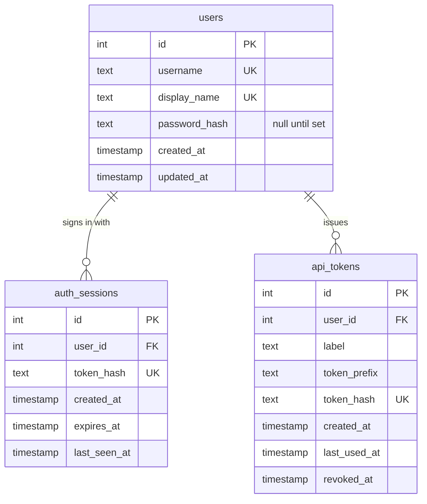

# User profile

The fields a person has, and the tables that hold their credentials. Behavior of sign-in, sessions, and API tokens is decided in [Password login](../adr/password-login.md). This note is the schema.

## Profile fields

A profile is the signed-in person's own record. Other people are still managed on `/users` (add, rename the display name, delete). There are no roles.

| Field | Who can change it | Shown on the profile page | Notes |
| --- | --- | --- | --- |
| `username` | The person, on their profile | Yes, editable | Login name. Unique, compared case-insensitively. 1–100 characters, no control characters. Existing rows are copied from `display_name`. |
| `display_name` | The person, on their profile. Anyone signed in can also rename it on `/users` | Yes, editable | The name on issues, comments, and the top bar. Still unique, same rules as before. |
| Password | The person, on their profile, and only if they send the current password | Write-only | Never stored or returned. Minimum 12 characters, maximum 128. Must not match the username. A change revokes other browser sessions. |
| `created_at` | Nobody | Yes, read-only | When the row was created. |

These are not profile fields:

* Email, avatar, timezone, biography. Keel has no mailer and the stories do not ask for them.
* Roles or permissions. Signed-in people remain trusted equals.
* Two-factor secrets. A second factor is out of scope.
* `password_hash`, session tokens, and API token secrets.

`KEEL_DEFAULT_USER`, when set, still names the first person on an empty database and leaves the password unset. When it is unset and `KEEL_SEED_SIGN_IN` is true (the default), that first person is username `keel` with password `keel`. That password is shorter than 12 characters and matches the username; it is the only password created that way. Changing it, and every other password, still follows the rules above. A database that already has a person is not given this account. Production sets `KEEL_SEED_SIGN_IN` false so a rebuilt empty database does not receive it either.

## Credentials stored beside the profile

| Table | Purpose |
| --- | --- |
| `users.password_hash` | Argon2id hash. Null until `keel users set-password` or the add-user form sets one. A null hash cannot sign in. |
| `auth_sessions` | Browser sessions. The cookie holds a random token; the row holds its SHA-256 hash, an absolute expiry of 14 days, and `last_seen_at`. |
| `api_tokens` | Personal access tokens for scripts and the Cursor agent. The create response shows the secret once. The row holds a SHA-256 hash, a short prefix for the profile list, and `revoked_at`. |

## Schema



`username` is unique on `lower(username)`. `display_name` stays uniquely constrained as stored. Deleting a user still fails while an issue or comment names them. Sessions and tokens are removed with the user.

## Password recovery

There is no email reset. On the server:

```bash
keel users set-password USERNAME
keel users create-token USERNAME --label "Cursor agent"
```

`set-password` prompts twice when `--password` is omitted, replaces the hash, and revokes that user's browser sessions. `create-token` prints the secret once on standard output.
